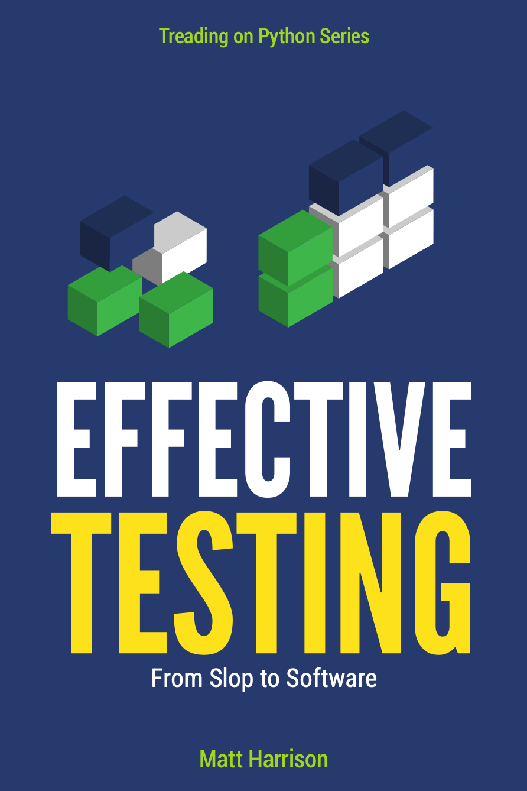

# Effective Testing with pytest & friends

A practical guide to testing Python code with pytest, doctest, type checking, uv, GitHub actions, precommit hooks, linting and more.

## About the Book

*Effective Testing* shows you how to write tests that catch bugs, document behavior, and keep your code maintainable. You'll learn pytest from the ground up, explore property-based testing with Hypothesis, integrate type checking with ty, and automate quality checks with Ruff and git hooks.

This book emphasizes practical, hands-on examples using a small Markov chain project that evolves throughout the chapters. You'll see how to write clear tests, when to use different testing approaches, and how to build a testing workflow that actually helps you ship better code.

## Get the Book

- **[metasnake.com](https://store.metasnake.com/testing)** - Direct from the author
- **[Amazon](https://amazon.com)** - Also available on Amazon

## What's Inside

- Doctest for executable documentation
- pytest fundamentals and advanced features
- Fixtures, parametrization, and markers
- Property-based testing with Hypothesis
- Test-driven development workflows
- Monkeypatching and mocking strategies
- Code coverage and what it means
- Type checking with ty and pytest-ty
- Linting and formatting with Ruff
- Git hooks with prek
- CI/CD with GitHub Actions
- Testing in Jupyter notebooks with ipytest

## Code Examples

All code examples from the book are available in the chapter directories. Each chapter's code is a working project you can run and experiment with.

## Found an Issue?

If you find errors, typos, or have suggestions for improving the book, please [open an issue](https://github.com/mattharrison/effective-testing/issues). Your feedback helps make the book better for everyone.

## About the Author

Matt Harrison is a Python trainer at Metasnake with over two decades of experience. He has taught Python to thousands of developers at companies worldwide and has written several books on Python and data science.

## Need Help with Your Team?

If you're interested in training or consulting services to help your team improve their testing practices (or Python, data science, AI/ML, etc.), please visit [metasnake.com](https://metasnake.com) to learn more about how we can help. I'd love to jump on a call to discuss your needs.

## License

The code examples in this repository are provided for educational purposes. Please refer to the book for full text content.
